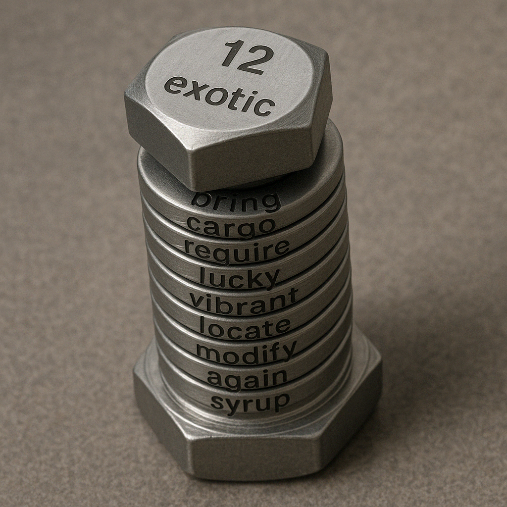
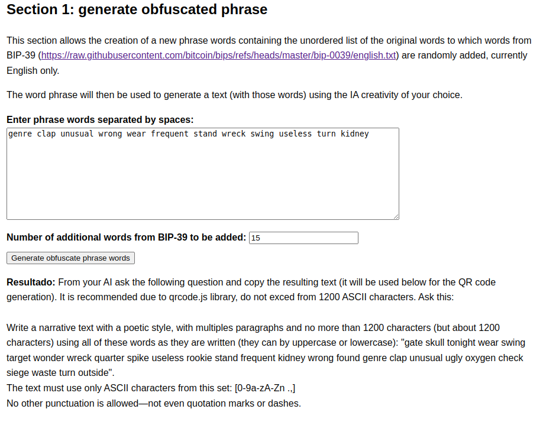
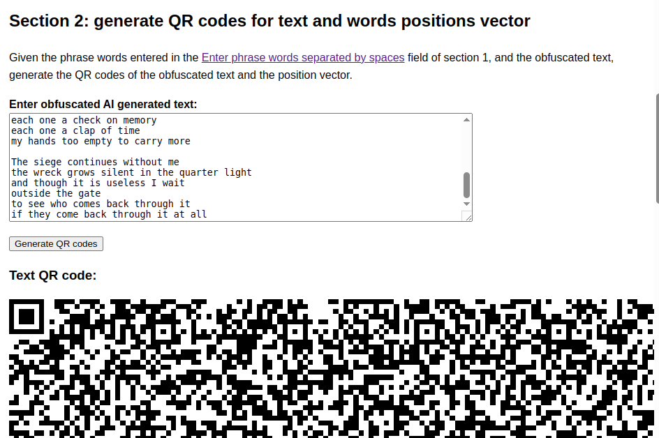
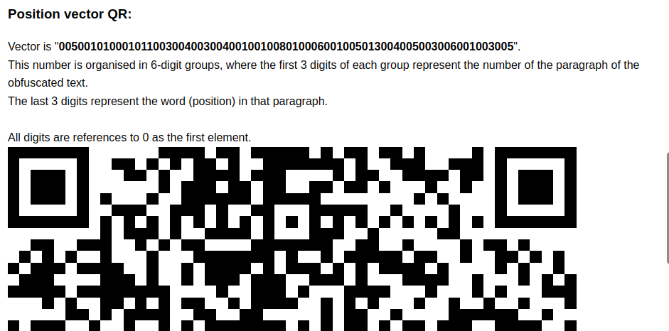
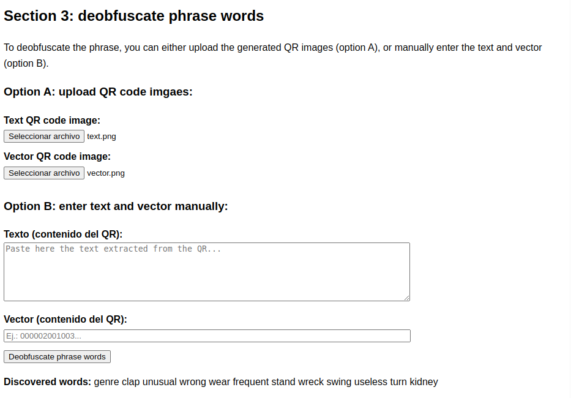

# opw

**Obfuscate Phrase Words** (<https://github.com/orencio/opw>) is a tool designed to obscure the content of the seed phrase words used to generate a Bitcoin (and other) wallet.

The idea for this tool emerged after a Bitcoin meetup where most attendees agreed that the seed phrase words for a wallet should be printed and kept hidden, just in case everything else fails.

I was surprised, altough not to say it's wrong. I thought of those who engrave the words onto steel washers (and other methods).

So I thought, perhaps a better approach would be to take the original seed words and mix and shuffle them with another set of words from the BIP-39 list (<https://github.com/bitcoin/bips/tree/master/bip-0039>). With this new set of words, one could generate a readable text—a poem, for instance—that could be printed without raising suspicion or even encoded into a QR code for printing.

By itself, access to this text reveals little or nothing about its potential link to a wallet seed phrase. Even so, it would be highly unlikely that someone could deduce the original phrase in the correct order.

To recover the original seed phrase, it is necessary to identify the relevant words within the text and generate a reference vector that allows reconstruction of the original phrase (in the correct order).

This way, the text and the reference vector can be printed and stored in separate locations, either as plain text or as QR codes.

 

Finally, the phrase can be reconstructed manually or with the utility I propose.

You should download de html file and open only from your device: [opw.html](https://raw.githubusercontent.com/orencio/opw/refs/heads/main/opw.html) (after open, save it to your device path).
